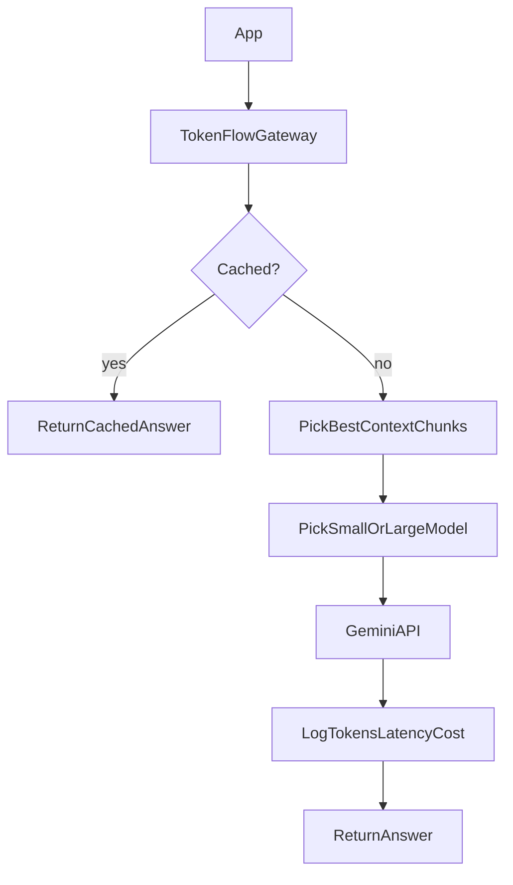

# TokenFlow

An LLM efficiency gateway that sits between your app and Gemini. It reduces token usage and cost through **semantic caching**, **smart RAG context selection**, and **model routing** — while measuring the quality tradeoff.

## Architecture

```text
App → TokenFlow Gateway → [Cache | RAG Select | Router] → Gemini → Metrics
```



## Quick start

### 1. Install dependencies

```bash
python3 -m venv .venv
source .venv/bin/activate
pip install -r requirements.txt
```

### 2. Configure environment

```bash
cp .env.example .env
# Add your GEMINI_API_KEY to .env
```

Get a key at [Google AI Studio](https://aistudio.google.com/apikey).

### 3. Start Postgres (semantic cache)

```bash
docker compose up -d
```

If port `5432` is already in use on your Mac, either stop the other Postgres or map Docker to another port (e.g. `5433:5432` in `docker-compose.yml` and update `DATABASE_URL` in `.env`).

### 4. Generate evaluation dataset (first time)

```bash
python -m evaluation.generate_dataset
python -c "from evaluation.splits import ensure_splits; ensure_splits()"
```

### 5. Run the server

```bash
uvicorn backend.main:app --reload --port 8000
```

### 6. Health check

```bash
curl http://localhost:8000/health
```

## API endpoints

| Endpoint | Description |
|----------|-------------|
| `GET /health` | Health check |
| `POST /chat` | Baseline Gemini passthrough (all optimizations off) |
| `POST /chat/optimized` | Full pipeline (respects feature flags in `.env`) |
| `GET /config` | Current feature flags and model names |
| `GET /cache/stats` | Number of cached entries |
| `GET /dashboard` | Results dashboard |

## Example requests

**Baseline chat:**

```bash
curl -X POST http://localhost:8000/chat \
  -H "Content-Type: application/json" \
  -d '{"message": "What is a mutex?"}'
```

**With RAG context chunks:**

```bash
curl -X POST http://localhost:8000/chat/optimized \
  -H "Content-Type: application/json" \
  -d '{
    "message": "According to the docs, what port does TokenFlow use?",
    "context_chunks": ["TokenFlow runs on port 8000.", "Postgres uses 5432.", "..."]
  }'
```

## Feature flags (.env)

```env
ENABLE_CACHE=true
ENABLE_RAG_SELECTION=true
ENABLE_ROUTING=true
CACHE_SIMILARITY_THRESHOLD=0.95
RAG_TOP_K=5
```

## Evaluation

TokenFlow includes a full benchmark harness:

| Script | Purpose |
|--------|---------|
| `evaluation/benchmark.py` | Run baseline vs optimized modes |
| `evaluation/judge.py` | LLM-as-judge quality scoring |
| `evaluation/cache_audit.py` | Cache threshold sweep |
| `evaluation/report.py` | Generate markdown/CSV report |

**Run a quick smoke benchmark (5 questions):**

```bash
python -m evaluation.benchmark --mode baseline --limit 5
python -m evaluation.benchmark --mode combined --limit 5 --clear-cache
```

**Run full dev-set benchmark:**

```bash
python -m evaluation.benchmark --mode baseline --split dev
python -m evaluation.benchmark --mode cache_only --split dev --clear-cache
python -m evaluation.benchmark --mode combined --split dev --clear-cache
```

**Judge quality:**

```bash
python -m evaluation.judge --results evaluation/results/latest.json
```

**Cache threshold audit:**

```bash
python -m evaluation.cache_audit --split dev
```

**Generate report:**

```bash
python -m evaluation.report
```

### Dev vs test split

- **120 dev questions** — tune thresholds here
- **30 test questions** — held-out set for final resume numbers only

Judge validated on 20 randomly sampled dev questions (`evaluation/results/manual_validation_sample.json`).

## Results

After running benchmarks on the **held-out test set** (30 questions), see:

- `evaluation/results/REPORT.md`
- `evaluation/results/REPORT.csv`
- Dashboard at `http://localhost:8000/dashboard`

Add a short results table and screenshots to this README once you have final numbers (dashboard, report table, optional cache audit). Raw JSON under `evaluation/results/` stays local (gitignored).

## Tests

```bash
pytest
```

## Project structure

```text
TokenFlow/
├── backend/          # FastAPI gateway, cache, RAG, router
├── database/         # Postgres + pgvector schema
├── evaluation/       # Dataset, benchmarks, judge, report
├── dashboard/        # Results visualization
├── tests/            # Unit tests
└── docker-compose.yml
```
